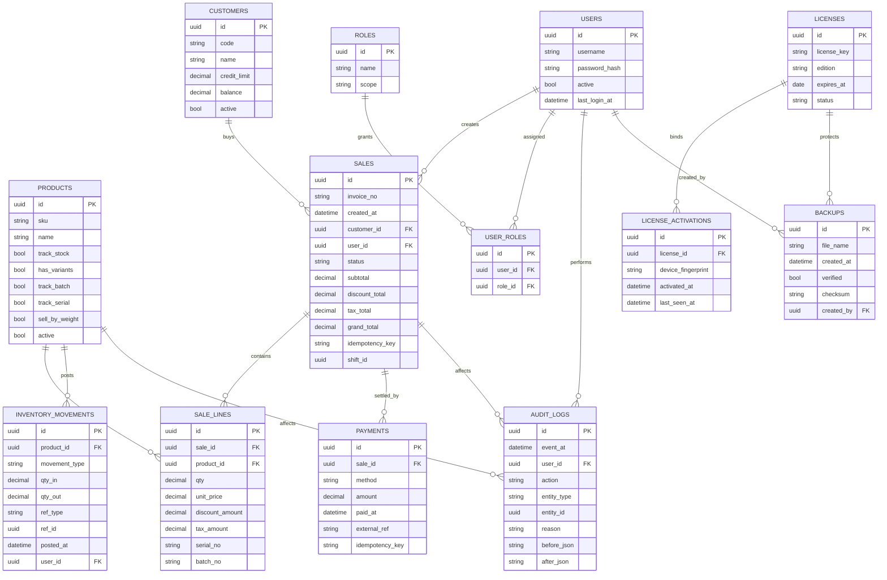
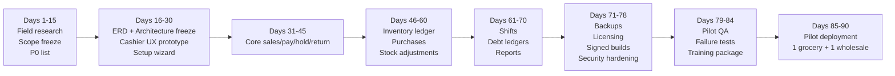

# تقرير منتج ميداني شامل لـ AMN RetailOS

## الملخص التنفيذي

AMN RetailOS يجب أن يُبنى منذ اليوم الأول كمنتج **local-first على Windows**، لا كنسخة مصغّرة من SaaS cloud POS. هذا ليس تفضيلاً هندسياً فقط؛ بل ضرورة سوقية. في العراق، شهدت خدمة الإنترنت قطوعات وطنية صباحية مرتبطة بالامتحانات يومي **20 مايو 2026** و**24 مايو 2026**، كما شهدت البلاد انقطاعاً كهربائياً واسعاً في الوسط والجنوب في **11 أغسطس 2025**. في المقابل، توثّق SQLite نفسها أنها مناسبة جداً لتطبيقات desktop والـ edge ذات الاتصال المتذبذب، لكنها تحذّر بوضوح من تشغيل قاعدة البيانات عبر **network filesystem** أو من توزيع الكتابة على عدة أجهزة مباشرة فوق ملف واحد. هذه النقطة وحدها تغيّر شكل المنتج كله: قاعدة البيانات يجب أن تكون محلية على نفس الجهاز الذي يشغّل المحرك، ومع التوسع لاحقاً إلى عدة أجهزة داخل المحل يتم ذلك عبر **local service / proxy** أو عبر **client/server DB** بعد نضوج المنتج، لا عبر مشاركة ملف قاعدة البيانات على الشبكة. citeturn27view0turn27view1turn23view2turn14view7turn25view4

### أهم الدروس الخفية التي يجب أن تحكم AMN RetailOS

| الدرس الخفي | لماذا هو أساسي |
|---|---|
| المحلي أولاً ليس ميزة إضافية | لأن بيئة العمل الفعلية فيها انقطاع إنترنت وكهرباء، والاعتماد على online checkout فقط سيكسر المحل في وقت الذروة. citeturn27view0turn27view1turn18view0 |
| لا تضع SQLite على shared folder | وثائق SQLite واضحة: **WAL لا يعمل على network filesystem**، والاستخدام عبر الشبكة يتطلب أن يكون المحرك على نفس الجهاز. citeturn14view7turn25view4 |
| بيع الكاشير يجب أن يكون idempotent | أي ضغطتان على “Pay” أو retry بعد timeout يجب ألا ينتجا فاتورتين أو دفعتين؛ هذه قاعدة side effects “مرة واحدة فقط”. citeturn25view0turn25view1turn25view2 |
| مخزونك يجب أن يكون movement-ledger لا مجرد quantity | لأن الجرد، المرتجعات، التلف، التحويل، الشراء، البيع، والتسوية يجب أن تُفسَّر وتُراجع لاحقاً. بدون ledger لن تعرف أين ضاع المخزون. الاستنتاج مدعوم بمشكلات stocktake، batch history، وvoid/comp reporting. citeturn21view0turn21view2turn28search5 |
| حذف الفاتورة بعد الحفظ يجب أن يكون ممنوعاً | المنتجات الناضجة تتعامل مع **void / return / credit note** بأسباب وصلاحيات وتقارير، لا بحذف صامت للسجل. citeturn28search3turn28search5turn15view9 |
| “Shift” ليس شاشة ثانوية | Microsoft Dynamics يعرّف الشفت كحدٍّ محاسبي تُقارن فيه القيمة المتوقعة بما عُدّ فعلياً. أي منتج بلا shift reconciliation سيخلق نزاعات يومية. citeturn14view8 |
| مشاكل الباركود يومية لا استثنائية | باركود غير موجود، باركود يفتح master product بدل variant، أو SKU/PLU mismatch في المنتجات الموزونة؛ هذه ليست edge cases. citeturn14view3turn14view4turn14view9turn18view3 |
| العربية على thermal printers تحتاج engine خاص | تقارير المطورين والمستخدمين تظهر انقلاب ترتيب الأحرف العربية أو طباعتها كرموز غير مفهومة إذا لم تُدار RTL/code page بشكل مدروس. citeturn14view0turn14view1turn14view2turn24view0turn24view1 |
| الكاش دراور تابع للطابعة غالباً | كثير من أعطال cash drawer أصلها في الطابعة أو كابل RJ12/DK، لا في البرنامج. البرنامج يجب أن يملك hardware diagnostics واضحة. citeturn17view0turn17view1turn23view1 |
| الطابعة يجب أن تُختبر بملف تعريف Printer Profile | المنتجات الناضجة تجعل test print وpaper size وprofile assignment جزءاً من الإعداد الإلزامي، لا خطوة اختيارية. citeturn17view3turn21view5 |
| المنتجات الموزونة تحتاج مسارين، لا واحداً | إما scale متصل مباشرة، أو barcode price-embedded من label-printing scale مع PLU متطابق. تجاهل هذا يخلق أخطاء سعر ووزن. citeturn17view4turn18view3turn14view9turn15view0 |
| Batch/Expiry/Serial ليست خصائص عامة لكل الأصناف | هذه **capabilities per item class**: تُفعَّل فقط عند الحاجة. GS1 وZoho يبيّنان قيمة بيانات lot/expiry/serial في التتبع والاسترجاع والمرتجعات. citeturn15view0turn15view1turn21view1turn21view2turn21view3 |
| المطاعم ليست “Retail mode مع أصناف أكثر” | تحتاج open tickets، coursing، kitchen printing حسب الفئة، kitchen names، waste/theoretical vs actual usage. citeturn21view4turn21view5turn20search3turn13search9 |
| العيادات والخدمات ليست “sales + customer” فقط | تحتاج appointments، resources، staff attribution، cancellation policy، ومنع double booking. citeturn17view8turn17view9turn9search4turn9search6 |
| الجرد أخطر من البيع إذا بُني بشكل سيئ | Shopify تحذّر من Zero All/Zeros Selected غير القابل للعكس ومن أثر missed items؛ هذا درس مهم لأي stocktake UX. citeturn21view0 |
| backup لا قيمة له إن لم يُتحقق منه | SQLite توصي بالـ backup API وVACUUM INTO وquick_check/integrity_check وerror log، كما توفر recovery API للإنقاذ لا للعودة المثالية. citeturn16view2turn16view8turn23view3turn23view4turn23view5 |
| التوقيع الرقمي Signed builds ليس رفاهية | Microsoft توضح أن code signing يثبت سلامة الحزمة وهوية الناشر، وSmart App Control يفضّل شهادات من مزودين موثوقين. citeturn15view4turn15view5turn23view0 |
| Salespeople يجب ألا يأخذوا build إنتاجي مفتوح | لأن ما يُعطى لهم عملياً هو ما يمكن نسخه وإعادة بيعه. build العرض، التفعيل، الأسرار، والمفاتيح يجب أن تبقى مركزية. هذا استنتاج مباشر من مبادئ least privilege وsecrets management. citeturn29view1turn29view5turn29view6 |
| Audit logs جزء من المنتج نفسه | OWASP تؤكد أن logs التطبيق مهمة أمنياً وتشغيلياً، وأن المعاملات عالية القيمة تحتاج trail يمنع العبث والحذف. citeturn24view6turn15view9 |
| AMN لا يجب أن يطلق “كل الأنماط” دفعة واحدة | تعقيد grocery/wholesale أقل بكثير من pharmacy/restaurant/clinic لأن الأخيرة تضيف batch/expiry، kitchen routing، أو appointment/resource logic. البدء بـ Retail/Grocery + Wholesale هو القرار الصحيح. citeturn15view0turn21view4turn17view8turn17view9 |

## المتطلبات الحرجة وأنماط المتاجر

### المتطلبات المفقودة الحرجة

الجدول التالي **تحليل مُركّب** مبني على وثائق SQLite وOWASP وNIST وPCI DSS وGS1 ووثائق تشغيل POS من Microsoft وSquare وShopify وLightspeed. الأولوية هنا عملية: **P0** يعني “بدونه لا تطلق المنتج”، و**P1** يعني “مهم للإطلاقات الأولى”، و**P2** يعني “بعد إثبات Core”. citeturn16view0turn24view4turn15view0turn23view1turn21view0turn28search5

| Requirement | Why it matters | Consequence if ignored | Priority | Affected store types |
|---|---|---|---|---|
| Local DB on same machine only | SQLite مناسب للـ desktop/edge لكنه لا يُشغَّل كملف مشترك للكتابة عبر الشبكة. citeturn23view2turn14view7turn25view4 | قفل، فساد بيانات، “database is locked”، وفشل عشوائي عند تعدد الأجهزة | P0 | الجميع |
| Inventory movements ledger | الجرد والتلف والشراء والبيع والمرتجع والتحويل يجب أن تُسجَّل كحركات قابلة للمراجعة. citeturn21view0turn21view2turn28search5 | فروقات مخزون بلا تفسير، تقارير ربح مضلِّلة | P0 | الجميع |
| Immutable invoice lifecycle | استخدم Void/Return/Credit Note بأسباب وصلاحيات بدل الحذف. citeturn28search3turn17view7turn15view9 | تلاعب موظفين، اختفاء أدلة، نزاعات مالية | P0 | الجميع |
| Idempotent save/pay | retries أو double click لا يجب أن تخلق أثرين ماليين. citeturn25view0turn25view1 | ازدواج فواتير/دفعات، انعدام الثقة بالنظام | P0 | الجميع |
| Shift & cash session model | الشفت هو وحدة الإقفال والمطابقة النقدية. citeturn14view8turn23view1 | نهاية يوم فوضوية، عجز/زيادة بلا مرجع | P0 | الجميع |
| Role-based access + manager approvals | RBAC وleast privilege معياران راسخان، والعمليات الحساسة يجب أن تمر عبر approval مسبب. citeturn24view2turn24view3turn29view5turn24view7 | خصومات غير مصرح بها، فتح drawer، حذف held orders، refund abuse | P0 | الجميع |
| Append-only audit log | OWASP توصي بتتبّع المعاملات المهمة مع حماية سلامة السجل. citeturn15view8turn15view9 | لا يمكن إثبات من غيّر ماذا ومتى ولماذا | P0 | الجميع |
| Verified backup/restore | backup API وVACUUM INTO وintegrity_check/recovery هي الأساس. citeturn16view2turn16view8turn23view4turn23view5 | نسخ احتياطية وهمية أو restore فاشل وقت الأزمة | P0 | الجميع |
| Print engine with Arabic/RTL strategy | العربية على thermal printer لا تعمل صح تلقائياً. citeturn14view0turn14view1turn14view2turn24view0 | فواتير مشوّهة، فقدان الثقة، فشل اعتماد العميل | P0 | الجميع خصوصاً العربية |
| Hardware setup wizard + test suite | الطابعات والدروج والماسحات والموازين تحتاج test print/test scan/test drawer/test scale. citeturn15view3turn17view0turn17view2turn17view4 | أعطال ميدانية تُفسَّر خطأ كأخطاء برمجية | P0 | الجميع |
| Barcode exception flow | variant/barcode mismatch وproduct-not-found حالات يومية. citeturn14view3turn14view4 | بطء طوابير، bypass يدوي، أخطاء سعر | P0 | Retail, Clothing, Electronics, Beauty, Grocery |
| Customer/supplier debt ledger | wholesale والبيع الآجل يحتاج credit limits ودفعات جزئية وحساب جارٍ. citeturn22search2turn22search12turn22search15 | ديون غير مضبوطة، تحصيل متعثر، تقارير كاذبة | P0 | Wholesale, Grocery, Clinic/Service |
| Held invoices / open tickets | الطلبات المؤجلة جزء من الواقع اليومي. citeturn21view6turn20search1turn20search8 | فقدان السلة، إعادة إدخال الطلب، أخطاء خدمة | P0 | Restaurant, Clinic/Service, بعض Retail |
| Signed installer + licensing | code signing يثبت سلامة الحزمة وهوية الناشر. citeturn15view4turn15view5turn23view0 | تحذيرات Windows، نسخ غير موثقة، إعادة بيع غير مصرّح بها | P0 | الجميع |
| Secrets never shipped to field staff | أسرار التفعيل والتوقيع والـ admin bypass يجب أن تبقى مركزية. citeturn29view1turn29view0 | استنساخ المنتج أو فتحه خارج سيطرتكم | P0 | AMN internal |
| Multi-unit conversion | wholesale والمواد الغذائية تحتاج carton/pack/piece أو kg/g وغيرها. مدعوم ميدانياً بمشكلات price lists والوزن والـ PLU. citeturn18view3turn22search2 | بيع وشراء بكميات غير متسقة، رصيد خاطئ | P0 | Wholesale, Grocery, Weight-based |
| Batch/expiry support as optional item capability | GS1 وbatch tracking يبرزان قيمة lot/expiry. citeturn15view0turn21view2 | استحالة سحب دفعات أو منع منتهية الصلاحية | P1 | Pharmacy, Food wholesale, Beauty |
| Serial/warranty support | serial tracking مهم للإلكترونيات والهواتف والضمانات. citeturn21view1turn21view3 | لا تعرف أي جهاز بيع لمن، ولا كيف تعالج المرتجع | P1 | Electronics/Mobile, Warranty stores |
| Weight/scale integration | scale-connected أو price-embedded barcode مساران مختلفان يجب دعمهما بوضوح. citeturn17view4turn17view5turn18view3turn14view9 | أسعار خاطئة وتعطّل البيع في اللحوم/الخضار/التوابل | P1 | Grocery, Weight-based |
| Diagnostics package | Square وممارسات SQLite/OWASP توضح قيمة logs diagnostics. citeturn14view5turn23view3turn24view6 | الدعم يتحول إلى تخمين واتصالات طويلة | P1 | الجميع |
| Migration + rollback discipline | تغييرات schema في SQLite تحتاج خطة دقيقة واختباراً وbackup قبل التنفيذ. citeturn25view6turn16view8 | تحديث يكسر قاعدة العميل ويوقف المحل | P1 | الجميع |
| Training/demo mode | التدريب الواقعي عبر simulator/virtual devices يقلل أخطاء الإطلاق. citeturn15view3 | موظفون يرتبكون، أخطاء بيع في أول أسبوع | P1 | الجميع |
| Recipe/theoretical usage | المطاعم تحتاج inventory by ingredients لا by menu only. citeturn21view4 | food cost غير صحيح، waste غير مرئي | P2 | Restaurant/Cafe |
| Appointment/resources engine | الخدمات تحتاج staff/resource/calendar logic. citeturn17view8turn17view9turn9search4 | double booking، attribution خاطئ، chaos في الصالون/العيادة | P2 | Clinic/Service, Salon/Gym |

### تحليل عميق لأنماط المتاجر

هذا الجدول ليس “feature checklist” نظرياً؛ بل هو قراءة تشغيلية لما يظهر فعلياً عند النزول إلى المحلات. الاختلاف الجوهري بين الأنماط ليس في شكل الشاشة، بل في **نوع الحقيقة المحاسبية والتشغيلية** التي يجب على الباكيند أن يحميها. citeturn15view0turn21view4turn17view8turn17view9turn21view1turn21view2

| نوع المتجر | سير العمل الحقيقي | المشاكل الخفية | Required modules | أخطاء المطورين الشائعة | MVP الآن | Later |
|---|---|---|---|---|---|---|
| Grocery / Mini Market | scan → cart → pay بسرعة، مع مرتجعات بسيطة وجرد دوري | طوابير، باركود غير موجود، وزن/PLU، drawer/printer faults، فروقات جرد ومفقودات. citeturn14view3turn17view0turn18view3turn21view0 | Sales, Returns, Inventory, Stocktake, Shifts, Barcode, Receipts | بناء UI كثيف بالـ mouse وعدم إعطاء مسار “scan-first” | Products, Sales, Returns, Shifts, Stocktake, Backup | Scale integration المتقدم، promotions engine |
| Wholesale Food Store | order كبير، multi-unit، آجِل، دفعات جزئية، SKU/pack/carton conversion | credit limits، multi-price، فروقات وحدات، expiry في بعض الأصناف، invoice debt flow. citeturn22search2turn22search12turn22search15turn21view2 | Price Lists, Customer Debt, Supplier Debt, Purchase, Inventory Movements, Multi-unit | التعامل معه كـ retail عادي بدون customer terms وlimits | Core sales + purchase + debt + multi-unit | Route delivery، order picking، batch/expiry advanced |
| Pharmacy | بيع سريع + batch/expiry + بدائل + مرتجع حسّاس | lot/expiry tracking، recall، منع بيع منتهي، customer trust. citeturn15view0turn21view2turn21view3 | Batch, Expiry, Returns by batch, Supplier lots, Warnings | جعل expiry مجرد text field غير مرتبط بالحركة | Delay to phase after core | FEFO, substitution rules, regulatory modules |
| Restaurant / Cafe | open ticket → kitchen route → add/hold/fire → settle | kitchen printers by category، open tickets، void/comp reasons، waste، recipe variance. citeturn21view4turn21view5turn20search3turn20search1 | Open Tickets, Printer Profiles, Kitchen Routing, Modifiers, Recipe Inventory, Shift closing | نسخ retail screen واعتبارها مطعماً | Delay from v0.1 | Floor plan, coursing, kitchen display, recipe costing |
| Clinic / Doctor / Service | appointment → service → optionally product sale → checkout | calendar/resources، staff attribution، cancellation policy، walk-ins. citeturn17view8turn17view9turn9search4turn9search6 | Appointments, Resources, Staff attribution, Service items, Customer notes | ربط كل شيء بمنتجات stock فقط | Delay from v0.1 | deposits, reminders, package sessions |
| Clothing Store | search/scan variant → try size/color → exchange/return | variant selection friction، barcodes per variant، exchange-heavy. citeturn14view3turn14view4turn13search10 | Variants, Returns/Exchanges, Label printing, Quick search | barcode واحد للمنتج الأم بدل variant-by-variant | Variant engine + exchange flow | loyalty, style matrix, season clearance |
| Electronics / Mobile | sell serialized unit + warranty + accessories + service/return | serial/IMEI، warranty proof، exchange/repair traceability. citeturn21view1turn21view3 | Serial Tracking, Warranty, Customer history, Returns by serial | خصم المخزون بالكمية فقط دون serial identity | بعد تثبيت core retail | repair tickets, service center handoff |
| Perfume / Cosmetics | variants/shades + offers + sometimes expiry/batch | shade confusion، duplicate SKU habits، expiry لبعض المنتجات. citeturn13search14turn21view2 | Variants, Promotions, Batch optional, Label printing | دمج shades تحت SKU واحد بلا variant identity | Retail core + variants | batch recall, loyalty bundles |
| Stationery / Gift Shop | mix of cheap fast items + some bundles/gifts | fast scan/search، seasonal stock، label printing | Retail core, Barcode, Labels, Inventory counts | overbuilding BOM/manufacturing مبكراً | Retail core | simple bundles/promotions |
| Laundry / Barber / Salon / Gym | booking أو ticket مفتوح + service + add-ons + sometimes memberships | schedule/resource conflicts، deferred payment، staff commission attribution. citeturn17view8turn17view9turn9search3 | Appointments, Resources, Service catalog, Staff attribution | تجاهل resource/time dimension | Delay from v0.1 | memberships, packages, recurring billing |
| Stores selling by weight | weigh item live أو scan price-embedded label | tare، scale stability، PLU mismatch، label format issues. citeturn17view6turn18view3turn14view9turn15view0 | Scale integration, Unit types, Tare, PLU mapping | اعتبار الوزن مجرد quantity manual | P1 after grocery pilots | advanced scale templates, deli counters |

الخلاصة العملية هنا: **Retail/Grocery + Wholesale Food** هما المساران الصحيحان لـ Core v0.1. الصيدلية والمطعم والعيادة ليست “modes” إضافية، بل تضيف طبقات حقيقة جديدة: **batch/expiry/recall** في الصيدلية، **kitchen routing + recipe variance** في المطعم، و**appointments/resources** في العيادة. لذلك ضمّها باكراً سيزيد surface area بدون أن يعطيكم سوقاً ثابتاً سريعاً. citeturn15view0turn21view4turn17view8turn17view9

## هندسة الباكيند وسير الكاشير

### توصيات هندسة الباكيند

المسار الموصى به لـ AMN RetailOS هو: **Windows desktop app + local application service + SQLite on the same machine + signed installer + structured backup/recovery**. قاعدة البيانات يجب أن تُستخدم كملف محلي application file format على نفس الجهاز، مع **WAL** للسرعة والتزامن المحلي، و**busy_timeout** متعمد، و**foreign_keys=ON** على كل connection لأن SQLite لا تفرضها افتراضياً. لا تستخدم **journal_mode=OFF** أو **MEMORY** في الإنتاج؛ الوثائق صريحة أن ذلك يعرّض قاعدة البيانات للفساد عند الانهيار أثناء transaction. citeturn23view2turn16view5turn16view6turn16view7turn25view5

القاعدة الذهبية هي فصل “الحقيقة المالية” عن “عرض الشاشة”. شاشة الكاشير لا يجب أن تعدّل quantities أو balances مباشرة. بدلاً من ذلك، كل عملية تولِّد حدثاً مضبوطاً داخل **transaction** واحدة: `sale created`، `payment recorded`، `inventory_movement posted`، `customer_ledger entry posted`، `audit_log appended`. SQLite توفّر **serializable isolation** فعلياً عبر تسلسل الكتابات، لكن هذا يعني أيضاً أنه لا يوجد إلا writer واحد في اللحظة الواحدة؛ لذلك يجب أن تكون transactions قصيرة جداً، وأن تُجمّع التعديلات ضمن وحدة حفظ واحدة، وأن تتعامل الواجهة بهدوء مع `SQLITE_BUSY` بدل crash أو duplicate save. citeturn16view4turn16view5turn16view6

#### الوحدات الأساسية المقترحة

| Module | الوصف العملي | Priority |
|---|---|---|
| Catalog | منتجات، Variants، Barcodes، Units، Taxes، optional capabilities | P0 |
| Sales | Sale header/lines، discounts، holds، cancellations، receipts | P0 |
| Payments | cash/partial/mixed/on-account، idempotency keys | P0 |
| Inventory | inventory_movements، stock snapshots، adjustments، stocktake | P0 |
| Customers/Suppliers | cards، ledgers، debt، credit limits، price lists | P0 |
| Purchases | purchase invoices، receiving، supplier debt | P0 |
| Shifts/Cash | open/close shift، float، cash in/out، reconciliation | P0 |
| Security | users، roles، approvals، audit log | P0 |
| Backup/Restore | scheduled backups، verification، restore wizard | P0 |
| Licensing | device activation، grace period، transfer request | P0 |
| Hardware | printers/scanners/drawer/scales profiles + diagnostics | P1 |
| Batch/Expiry/Serial | item-class capabilities | P1 |
| Restaurant/Service | kitchen/appointments/resources | P2 |

#### الهيكلية الأساسية لقاعدة البيانات

الـ ER التالي يمثل نواة قاعدة البيانات التي تحقق الحد الأدنى الصحيح للمحاسبة والتتبّع والتفعيل والنسخ الاحتياطي. هو تصميم تحليلي مبني على متطلبات SQLite integrity، وaudit trail، وinventory movement ledger، وlicensing control. citeturn16view7turn15view9turn16view2turn23view5

#### قواعد غير قابلة للتفاوض في الباكيند

أولاً، كل عملية مالية يجب أن تكون داخل **single transaction boundary** تبدأ بـ `BEGIN IMMEDIATE` أو ما يكافئه في library تُفضل writer reservation مبكراً، وتغلق بـ `COMMIT/ROLLBACK`. ثانياً، أي زر تنفيذي في الواجهة يجب أن يولِّد **idempotency_key** محلياً قبل إرسال العملية إلى الباكيند؛ إذا انقطع الرد أو كرر المستخدم الضغط، يعيد النظام نفس النتيجة ولا يكرر الأثر. ثالثاً، أي حركة مخزون مرتبطة بمستند يجب أن تحمل `ref_type/ref_id` حتى يمكن عكسها محاسبياً لاحقاً بدل تسوية مبهمة. هذا استنتاج مباشر من مبادئ transactions وidempotency ومن واقع comp/void/returns reportability. citeturn16view4turn25view0turn25view1turn28search5

رابعاً، لا تحفظ `on_hand` كحقل الحقيقة الوحيد. احتفظ به كـ **cached projection** يمكن إعادة بنائه من `inventory_movements` عند الحاجة. الحقيقة يجب أن تكون ledger. خامساً، رقم الفاتورة يجب أن يكون **immutable after commit** مع prefix اختياري للموقع/الجهاز، وأي إلغاء لاحق لا يزيل الرقم بل يضع المستند في lifecycle جديد: `voided`, `returned`, `credited`. سادساً، `foreign_keys=ON` إجباري على كل connection، لأن SQLite لا تفرضها تلقائياً. citeturn16view7turn25view7turn15view9

#### النسخ الاحتياطي والاسترجاع والتعافي

النسخ الاحتياطي الصحيح في SQLite ليس “Copy file while app is running” كسياسة أساسية. استخدم **backup API** للنسخ الحي، و**VACUUM INTO** لنسخ دورية نظيفة منخفضة الحجم. بعد كل backup شغّل تحققاً آلياً: hash + open test + `quick_check` أو `integrity_check` حسب نافذة الوقت. أيضًا فعِّل **SQLite error logger** لأن SQLite نفسها توصي به بشدة لاكتشاف `SQLITE_NOTICE_RECOVER_WAL`, `SQLITE_CORRUPT`, `I/O` issues في الميدان. وعند الفساد الحقيقي، عامل **`.recover` / recovery API** كعملية salvage لا كاستعادة مثالية؛ النتيجة قد تخرج بقيود مكسورة أو بيانات ناقصة، لذلك يجب أن يعود العميل أولاً إلى آخر backup موثوق، ثم تُستخدم recovery كخيار إنقاذ ثانٍ. citeturn16view2turn16view3turn16view8turn23view3turn23view4turn23view5turn30view0

#### الـ migrations والتحديث والـ rollback

في SQLite، تغييرات schema غير التافهة ليست بسيطة؛ وثائق `ALTER TABLE` نفسها توضّح أن التعديل المتقدم يعني غالباً إنشاء جدول جديد ونقل البيانات ثم إعادة التسمية، مع تحذير واضح من لمس `sqlite_schema` دون اختبارات دقيقة وbackup مسبق. لذلك AMN يجب أن يملك **migration engine م_VERSIONed** داخل التطبيق: preflight backup، check disk space، run migration، `integrity_check`، smoke test على تقارير أساسية، وإلا **rollback by restore** إلى backup ما قبل التحديث. لا تعتمد على “update in place and hope”. citeturn25view6turn16view8

### توصيات تجربة الاستخدام وسير الكاشير

الـ UX في أنظمة POS لا يُقاس بجمال الواجهة بل بعدد الثواني والأخطاء في الصف. أفضل قاعدة تصميم لـ AMN هي: **scan-first, keyboard-first, failure-friendly**. دعم الماوس يبقى موجوداً، لكن المسار الرئيسي يجب أن يسمح للكاشير أن يبيع بيده اليمنى على scanner وباليسرى على keyboard بلا تنقّل بصري مربك. هذا يتماشى مع scanners كوسيلة checkout سريعة، ومع واقع المتاجر التي تفضّل keyboard wedge وHID لمرونة العمل والبحث والجرد. citeturn14view3turn23view1turn21view0

#### مسار البيع السريع المقترح

| عنصر UX | التوصية العملية | لماذا |
|---|---|---|
| Focus ثابت على خانة البحث/scan | بعد كل scan يعود focus تلقائياً | لتقليل لمس الماوس وزمن التفاعل |
| Barcode-first | scan يضيف مباشرة للعربة عندما توجد مطابقة وحيدة | هذا هو المسار الطبيعي في retail. citeturn14view3 |
| Product-not-found dialog | اقتراحات فورية: search by name/SKU، quick add مؤقت، أو manager override | لأن barcode exceptions يومية |
| Held invoice / parking | `F6` مثلاً لحفظ السلة، `F7` لاسترجاعها | open tickets جزء أساسي من الواقـع. citeturn21view6turn20search8 |
| Quantity/discount hotkeys | `+/-`, `Ctrl+D`, `Ctrl+Q` | لتقليل الوقت داخل الصف |
| Quick customer attach | `F4` للزبون/الحساب الآجل | مهم للديون والبيع بالجملة |
| Split/partial payment | زر واضح + حماية من double submit | لأن partials تظهر في التقارير الفعلية. citeturn28search9 |
| Return/Exchange wizard | scan receipt أو search invoice ثم return lines واحداً واحداً | لمنع إساءة المرتجعات |
| Shift close flow | expected vs counted + discrepancy reason mandatory | لأن الإقفال عملية محاسبية لا مجرد نافذة. citeturn14view8 |
| Manager approval modal | username/password ثانوي + reason + audit | للـ discounts/void/open drawer/delete held order. citeturn28search1turn24view7 |

في العربية، لا يكفي أن يكون النص داخل التطبيق RTL؛ يجب أن تكون **الواجهة بالكامل BiDi-aware**: محاذاة، ترتيب عناصر، أزرار back، وحالات mixed Arabic/English/SKU/price. Windows نفسها توصي بمراعاة **UI mirroring** وmixed text support، وهذه النقطة تصبح أشد حساسية في receipt preview حيث تتجاور العربية مع أرقام وأسعار وأكواد لاتينية. لذلك أوصي بمحرك Receipt Template فيه: preview حي، fallback font، RTL mode per template، وخيار rendering عبر Windows printer driver عند فشل ESC/POS المباشر بالعربية. citeturn24view0turn24view1turn14view0turn14view1turn14view2

للمستخدمين الضعفاء بالحاسوب، لا تصمّم AMN على فرض أنهم سيتذكرون عشرات الحالات. التصميم الصحيح هنا هو **progressive disclosure**: شاشة بيع بسيطة جداً، مع “manager panes” مخفية خلف صلاحيات، ورسائل خطأ بشرية مثل: “الميزان غير متصل”، “الطابعة متصلة لكن بلا profile”، “الفاتورة محفوظة مسبقاً، تم استرجاع النتيجة السابقة” بدلاً من stack trace أو codes غامضة. OWASP أيضاً تحذّر من تسريب التفاصيل التقنية غير اللازمة للمستخدم. citeturn17view3turn17view4turn7search14

التدريب يجب أن يتم على **Training mode** وليس على production DB. Microsoft Dynamics حتى توفّر **Peripheral Simulator** لتدريب واختبار scanners/printers/drawers/scales دون عتاد حقيقي. في AMN، Training mode يجب أن يغيّر watermark الواجهة، يمنع أي أثر على production data، ويتيح أمثلة جاهزة: بيع نقدي، مرتجع، فتح شفت، عطل طابعة، خصم يحتاج approval. citeturn15view3

## الأمان ومنع إعادة البيع والنشر الميداني

### خطة الأمن ومنع إعادة البيع

من منظور AMN، “الأمان” ليس فقط منع هكر خارجي؛ بل أيضاً ضبط ما يمكن للموظف والكاشير والمسوّق والوكلاء فعله بالمنتج نفسه. لذلك أوصي بطبقات حماية متراكبة: **RBAC**, **approval gates**, **append-only audit**, **signed builds**, **offline activation**, و**AMN control center** minimal لإدارة licenses والdevices والbuild channels. هذا متوافق مع RBAC من NIST، ومبادئ least privilege وauthorization وlogging وsecrets management من OWASP، ومع SSDF من NIST. citeturn24view2turn24view3turn15view7turn15view8turn16view0turn29view1turn29view5

#### طبقات التحكم المقترحة

| الطبقة | ما يجب فعله |
|---|---|
| RBAC | Roles صريحة: Cashier, Senior Cashier, Inventory Clerk, Store Manager, AMN Support, AMN Admin |
| Approval gates | خصم فوق حد معيّن، تغيير سعر، void كامل، refund نقدي، حذف held invoice، فتح cash drawer بدون بيع، restore backup، activation transfer |
| Audit | كل عملية حساسة: who/when/device/before/after/reason/approval_by |
| Device identity | fingerprint للجهاز لا يعتمد على قيمة واحدة فقط؛ استخدم mix من motherboard/disk/OS stable attributes مع tolerance |
| Licensing | License key + activation record + offline challenge/response + grace period محدود |
| Build provenance | قناتا build منفصلتان: Demo channel وProduction channel |
| Secret isolation | جميع الأسرار والتوقيع والتفعيل في AMN control center فقط |
| Operational monitoring | تقارير activations، restores، repeated voids/discounts، failed approvals |

**ما لا يجب إطلاقاً إعطاؤه للمسوّقين أو المندوبين:**  
`master production license`, private key لشهادة التوقيع، أي **universal bypass code**، أي build فيه hidden admin menu، database encryption master key إن وجد، access إلى control center الإنتاجي، أو أداة restore/activation تُولّد تراخيص بلا مراجعة. OWASP توضح أن hardcoded secrets أو توزيع الأسرار على نطاق واسع يضاعف التسريب ويصعّب معرفة المصدر. citeturn29view1turn29view0

#### النموذج العملي لمنع إعادة البيع غير المصرّح بها

الأفضل هو الفصل بين **Demo license** و**Production license**. نسخة العرض يجب أن تكون موقعة Signed، ولكن فيها واحد أو أكثر من القيود الواضحة: watermark، عدد أيام محدود، عدد فواتير يومي محدود، بيانات مثال فقط، وتعطيل backup restore من الجهاز إلى بيئات أخرى. نسخة الإنتاج لا تعمل إلا بعد **activation** يربط الترخيص بجهاز محدد، مع **offline challenge/response** للمحلات التي لا يتوفر فيها إنترنت، و**grace period** قصير فقط للحالات الطارئة مثل تغير الهارد أو عطل Windows. وجود signed build مهم هنا لأنه يتيح للعميل التحقق من هوية الناشر، ويقلل مخاطر العبث بالحزمة بعد التوقيع. citeturn15view4turn15view5turn23view0

في إدارة كلمات المرور وبيانات الاعتماد، لا تخزّن passwords نصاً خاماً أو reversible encryption. OWASP توصي بوضوح باستخدام **Argon2id أو bcrypt أو PBKDF2** مع salt فريد، وألا تُستعمل fast hashes مثل SHA-256 لتخزين كلمات المرور. وإذا كان الـ stack لديكم .NET، فاستعملوا framework hasher أو مكوّنات crypto الموثوقة بدل ابتكار scheme خاص بكم. كذلك، أي credentials للـ control center أو الدعم يجب أن تمر عبر TLS فقط. citeturn15view6turn29view3turn12search1turn29view4

إذا دخلتم لاحقاً في المدفوعات بالبطاقات، فلا تجعلوا AMN يخزّن أو يمرّر بيانات البطاقة داخلياً إلا إذا كنتم مستعدين فعلاً لتحمّل متطلبات **PCI DSS**. PCI DSS صريحة بأن كل الكيانات التي تخزن أو تعالج أو تمرر cardholder data تدخل في النطاق الأمني. التوصية العملية لكم هي استخدام **external PCI-compliant terminal / payment connector**، وعدم تخزين card data داخل AMN إطلاقاً كلما أمكن، لأن تقليل التخزين هو أفضل حماية. citeturn24view4turn16view1turn29view0

### قائمة فحص العتاد والنشر

العتاد في مشاريع POS ليس “ملحقات”؛ بل جزء من حدود النظام نفسه. Microsoft Dynamics توضّح أن printers/scanners/cash drawers/line displays تُدار كسلسلة تشغيلية كاملة، وأن بعض البيئات تحتاج حتى **Peripheral Simulator** لعزل مشاكل الdriver عن مشاكل البرنامج. لذلك يجب أن يكون لدى AMN **hardware compatibility list** قصيرة ومختبرة، لا قائمة “أي شيء يعمل”. citeturn23view1turn15view3

#### Checklist النشر الميداني

| العنصر | ما أوصي به عملياً |
|---|---|
| Laptop baseline | Windows حديث مدعوم، SSD، RAM كافية، منفذا USB على الأقل، user account واضح، power plan ثابت |
| Receipt printers | دعم 58mm و80mm، test print إلزامي، paper size/profile محفوظ، preview للفاتورة، دعم Epson/Star أولاً لأن دعم المنظومات الكبيرة يفضّلهما. citeturn23view1turn17view3turn21view5 |
| Barcode scanners | HID/keyboard wedge أولاً لخفض التعقيد، مع تفضيل 2D-ready من الآن؛ GS1 تسير باتجاه 2D at POS وMode 1 هو الحد الأدنى العملي. citeturn23view1turn15view1turn28search6 |
| Cash drawer | اربطه بالطابعة أو بواجهة مدعومة فقط؛ افحص RJ12/DK port، lock position، وmanual eject. citeturn17view0turn17view1 |
| Label printers | اختر مقاسات مدعومة ومحددة مسبقاً؛ لا تعد العميل بتخصيصات label مفتوحة منذ البداية. citeturn14view4 |
| Scales | فرّق بين USB/Bluetooth scale وبين label-printing scale؛ لا تخلط flow الموزون الحي مع flow الباركود السعري. citeturn17view4turn18view3turn14view9 |
| Scanner-scale | صالح للمتاجر السريعة لكن يحتاج كابلات وتثبيت ومعايرة حقيقية، ولا بد من اختبار barcodes مطبوعة على ورق لا على شاشة. citeturn17view5turn17view6 |
| Customer display | line display بسيط لعرض الاسم/الإجمالي أفضل من محاولة شاشة ثانية معقدة في البداية. citeturn23view1 |
| Local network | إن احتجت أكثر من جهاز لاحقاً، استخدم local service على جهاز مضيف أو DB client/server، لا shared SQLite file. citeturn14view7turn25view4 |
| USB stability | بعد كل setup نفّذ سيناريو unplug/replug للطابعة، scanner، والميزان داخل الهاتف الميداني للتسليم |
| Windows permissions | installer واضح، folder data خارج Program Files إن لزم، firewall rules مضبوطة فقط لما يحتاجه الـ local service |
| Antivirus false positives | وزّع **signed installer** فقط، بالـ trusted certificate قدر الإمكان. citeturn15view4turn23view0 |
| Offline activation | challenge/response printable أو via phone، مع device fingerprint وتاريخ تفعيل |
| License migration | “Deactivate old / activate new” أو transfer request من control center لا نسخ ملف license يدوياً |

النقطة العملية الأهم في التثبيت: **Setup Wizard** يجب أن يجمع حقولاً موحدة دائماً: اسم المتجر، نوع النشاط، العملة، تنسيق الضريبة، اسم الطابعة ونوعها، عرض الورق، scanner mode، هل يوجد cash drawer، هل توجد scale، مسار backup المحلي، أيام الاحتفاظ، اسم المدير، سياسات returns/discount limits، وبيانات license. كل عنصر hardware يجب أن يملك اختباراً مباشراً داخل الـ wizard: `Print test`, `Open drawer`, `Scan test`, `Scale test`, `Backup test`. citeturn17view3turn17view4turn15view3

## التشغيل والدعم ونسخة MVP

### خطة التشغيل والدعم

أكثر تذاكر الدعم في هذا النوع من المنتجات تكون عادةً حول: الطابعة لا تطبع، drawer لا يفتح، scanner يكتب أرقاماً في المكان الخطأ، الميزان لا يظهر، النسخة الاحتياطية لم تُسترد، الفرق بين النقد المتوقع والمعدود، مستخدم نسي كلمة المرور، أو البيع توقف بعد update/Windows change. هذه ليست “مشاكل صغيرة”؛ بل هي مركز تكلفة الدعم. Square تملك حتى **diagnostic report** مدمجاً لإرسال Ledger الدعم، وSQLite توصي بتفعيل error logger ميدانياً، وOWASP تذكّر أن application logging له قيمة تشغيلية وأمنية معاً. citeturn14view5turn23view3turn24view6

#### ما يجب أن يحتويه Diagnostic Package

| العنصر | لماذا |
|---|---|
| App version + build channel + signature status | لمعرفة هل الجهاز على Demo / Production / patch |
| DB version + migration history | لمعرفة أين كسر التحديث |
| SQLite error log excerpt | لالتقاط recover/corrupt/io/busy events. citeturn23view3 |
| Hardware profile | printer/scanner/drawer/scale type + last test time |
| Recent audit log | لتمييز خطأ مستخدم عن bug |
| Last backup metadata | file name, checksum, verified yes/no |
| Shift status | مفتوح/مغلق، expected cash vs counted |
| License status | device fingerprint, activation time, grace status |
| Safe system snapshot | disk free space، local time، Windows user، network status |
| Sanitised screenshots / receipt templates | لحل مشكلات RTL والطباعة |

الدعم عن بُعد يجب أن يكون **read-only by default** مع session logging. لا تعطوا أداة remote admin كاملة لكل عضو دعم. أقل صلاحية ممكنة هي القاعدة الصحيحة. أيضاً، backup verification يجب أن يكون **Scheduled + Human visible**: لون أخضر/أصفر/أحمر داخل لوحة الإعدادات، مع آخر تاريخ backup verified، وآخر محاولة restore test. citeturn29view5turn15view9turn24view6

#### Onboarding وPost-install

Onboarding العميل يجب أن يمر بثلاث قوائم منفصلة:  
**Pre-install:** فحص Windows، المساحة، الطاقة، الطابعة، صلاحيات المستخدم، المسار المخصص للبيانات.  
**Go-live setup:** إنشاء المدير، role matrix، المنتجات الأساسية، الضرائب، printer/scanner/drawer tests، backup destination، first activation.  
**Post-install:** فاتورة بيع اختبارية، مرتجع اختبار، فتح/إغلاق shift، backup test، restore-on-spare-folder test، وتسليم owner ورقة سياسة التشغيل والطوارئ. هذا يشبه منطق “train/test/debug with simulator” الموجود في المنتجات الناضجة. citeturn15view3turn17view3turn17view4

#### اقتراح SLA عملي لبداية AMN

- **P0 outage داخل البيع**: استجابة أولية خلال ساعة عمل، ومحاولة استعادة التشغيل في نفس اليوم.  
- **P1 defect غير مانع للبيع**: خلال 24–48 ساعة.  
- **P2 enhancement/support question**: يدخل backlog أسبوعي.  

هذا SLA يجب أن يكون مربوطاً فعلياً بوجود **diagnostic package**؛ من دون logs وأنظمة قياس لن تستطيعوا الوفاء به بانتظام. citeturn24view6turn14view5

### توصية MVP

#### تعريف AMN RetailOS Core v0.1

**النسخة v0.1 يجب أن تستهدف فقط:**  
Retail / Grocery / Mini Market + Wholesale Food الأساسية.

**ما يدخل الآن P0:**
- Product catalog + variants المحدودة + barcodes
- Sales + held invoices
- Cash payments + partial/on-account
- Returns / voids / credit-note-like reversal model
- Inventory movement ledger
- Purchases + receiving
- Customer/Supplier debt
- Shifts + cash reconciliation
- Role-based permissions
- Manager approvals + reasons
- Arabic/English receipts
- Backup/restore + verification
- Licensing + offline activation
- Basic reports: sales, payments, debt, shift, stock on hand, stock movement, voids/discounts

**ما يُؤجل P1/P2:**
- Restaurant modules
- Appointments/resources
- Advanced loyalty
- Kitchen displays
- Repair center / service tickets
- Advanced promotions engine
- Multi-branch sync الحقيقي
- Pharmacy regulation specifics
- Ecommerce sync

هذا التحديد ليس تقشفاً مفرطاً؛ بل هو حماية للمشروع من تشظي الأنماط قبل تثبيت core financial correctness. citeturn21view4turn17view8turn17view9turn15view0

#### جدول وحدات v0.1

| Module | Include now | Acceptance criteria |
|---|---|---|
| Catalog | نعم | إنشاء/تعديل/تعطيل صنف، barcode واحد أو أكثر، unit base، optional variant |
| Sales | نعم | sale محفوظة خلال < ثانيتين على جهاز متوسط، no duplicate commit عند الضغط المكرر |
| Payments | نعم | manual cash/partial/on-account مع ledger entries متوازنة |
| Inventory | نعم | كل sale/purchase/return/adjustment تُولّد movement قابل للتتبع |
| Shifts | نعم | فتح/إغلاق، expected vs counted، discrepancy reason |
| Audit | نعم | كل discount/change price/void/refund/open drawer/restore/license action مسجل |
| Backup | نعم | backup scheduled + manual + verify + restore to test folder |
| Licensing | نعم | online + offline activation، grace period، transfer request |
| RTL Receipts | نعم | preview صحيح عربي/إنجليزي، print test ناجح على 58 و80mm الأقل |
| Batch/Serial | لا في v0.1 الأساسي | مجرد hooks/flags في data model |
| Restaurant/Clinic | لا | مؤجل |

#### سيناريوهات الاختبار الإلزامية قبل أول Pilot

| السيناريو | المطلوب أن يحدث |
|---|---|
| Power loss أثناء حفظ sale | عند عودة التطبيق لا توجد half-sale؛ إما transaction committed كاملة أو غير موجودة. citeturn25view3turn16view4 |
| Printer failure بعد الحفظ | sale تُحفظ، ويظهر للمستخدم “sale saved / print pending or retry”، لا تُعاد العملية المالية |
| Double-click على Pay | نفس idempotency key يعيد النتيجة نفسها دون duplicate sale/payment. citeturn25view0turn25view1 |
| `SQLITE_BUSY` / DB locked | UI يعرض retry state لطيفاً، ولا crash، ولا duplicate write. citeturn16view6turn16view5 |
| Restore from backup | restore إلى folder منفصل ينجح مع `quick_check/integrity_check` وتفتح التقارير الأساسية |
| Arabic receipt on thermal | preview + actual print صحيحان، مع fallback rendering إذا فشل direct thermal path. citeturn14view0turn14view2turn24view0 |
| Cash drawer disconnected | sale تستمر، ويظهر warning دقيق، ويتم توجيه المستخدم إلى test/diagnostics |
| Product barcode not found | dialog سريع: search suggestions / quick add placeholder / cancel |
| Shift close with variance | لا يُسمح بالإغلاق بلا reason وبلا user trace |
| Backup device unplugged | يظهر فشل واضح داخل dashboard، ولا تُعرض المهمة كناجحة |

## البحث الميداني والمخاطر وخطة التنفيذ

### خطة البحث الميداني

البحث الميداني هنا يجب أن يكون **observation-first** لا interview-first فقط. ما يقوله صاحب المحل يختلف كثيراً عمّا يفعله الكاشير وقت الازدحام. الهدف هو تحويل كل ملاحظة إلى: **workflow → pain → rule → UI/API/data requirement**. citeturn21view0turn21view4turn17view8turn17view9

#### خطة الزيارات والأسئلة

| الزيارة | ماذا تسأل | ماذا تراقب | كيف تحوّل الملاحظة إلى Requirement |
|---|---|---|---|
| 3 Grocery stores | أكثر الأعطال؟ كيف يتعاملون مع barcode غير موجود، مرتجع، فرق صندوق، انقطاع كهرباء؟ | زمن البيع الحقيقي، استخدام scanner vs keyboard، أين تتوقف الطوابير، كيف يطبعون receipt | إذا توقف البيع بسبب product-not-found مرتين خلال 15 دقيقة ⇒ **P0 barcode exception flow** |
| 2 Wholesale stores | كيف تُدار الديون؟ هل لديهم أسعار مختلفة لنفس الزبون؟ كيف يحسبون pack/carton/piece؟ | هل يبيعون نقداً وآجلاً في نفس اليوم؟ كيف يراجعون الذمم؟ | إذا ظهر customer-specific pricing/credit limit ⇒ **P0 price lists + credit control** |
| 2 Pharmacies | كيف يتابعون expiry؟ هل يبحثون عن batch عند المرتجع؟ | هل التفتيش أو العزل يتم يدوياً؟ هل لديهم أصناف بدفعات متعددة؟ | إن كان recall/expiry يستهلك وقتاً يدوياً ⇒ **P1 batch/expiry engine** |
| 2 Restaurants/Cafes | كيف تنتقل الطلبات للمطبخ؟ ماذا يحدث عند تعديل الطلب؟ | المطبخ، تذاكر المطبخ، التأخير، الإلغاء، الـ comp/void | إذا الطلبات تُقسم بين محطات متعددة ⇒ **P2 printer routing by category** |
| 1 Clinic/Service business | كيف تُحجز المواعيد؟ كيف تُنسب الخدمة لموظف؟ | ازدواج الحجوزات، walk-ins، إلغاء الموعد | إذا ظهر resource/time conflict ⇒ **P2 appointments/resources** |

#### Template ملاحظات الزيارة

استخدم هذا القالب لكل زيارة:

| الحقل | المحتوى |
|---|---|
| اسم النشاط / الحجم |  |
| عدد نقاط البيع / الأجهزة |  |
| عدد المستخدمين في الشفت |  |
| نوع الطابعة / scanner / drawer / scale |  |
| أسرع سيناريو بيع |  |
| أبطأ سيناريو بيع |  |
| أكثر 3 أخطاء تتكرر |  |
| كيف يتعاملون مع المرتجع |  |
| كيف يغلقون اليوم |  |
| كيف يعمل backup الآن |  |
| ماذا يحدث إذا انقطعت الكهرباء أو الإنترنت |  |
| متطلبات قالوها بصراحة |  |
| متطلبات لاحظناها ولم يذكروها |  |
| قرار AMN | P0 / P1 / Ignore / Needs pilot |

#### كيف تحول النتائج إلى backlog محترف

لكل ملاحظة ميدانية، أنشئ بطاقة requirement بهذا الشكل:

- **Observation:** الكاشير يخرج من شاشة البيع ليبحث يدوياً عن المنتج عند barcode miss  
- **Risk:** انتظار + طابور + احتمال بيع بسعر خاطئ  
- **Rule:** لا يجوز مغادرة شاشة البيع لمعالجة barcode miss  
- **Requirement:** Product-not-found overlay داخل شاشة البيع  
- **Acceptance:** يمكن إكمال المعالجة خلال ≤ 5 ثوانٍ من نفس الشاشة  
- **Priority:** P0

هذا الأسلوب هو ما يفرّق بين “قائمة أفكار” وبين Product backlog حقيقي.

### مصفوفة المخاطر

| Risk | Probability | Impact | Prevention | Detection | Recovery plan |
|---|---|---|---|---|---|
| Duplicate sale/payment | Medium | Very High | idempotency keys + disabled repeated submit | audit rule + duplicate detector | reverse one doc and reconcile ledger |
| Inventory drift over time | High | High | movement ledger + controlled stocktake | stock discrepancy reports | stock adjustment with reason and owner approval |
| Printer/Drawer field failures | High | Medium | certified hardware list + setup tests | hardware diagnostics | fallback to save-and-reprint / manual drawer key |
| Corrupt or unusable backup | Medium | Very High | backup API + verify + restore tests | backup health dashboard | restore previous verified backup, then salvage with recovery only if needed |
| SQLite lock contention | Medium | Medium | short transactions + busy_timeout + local service | `SQLITE_BUSY` telemetry | retry queue + operator-friendly retry UI |
| Failed migration/update | Medium | High | preflight backup + staged rollout + integrity check | migration report | restore pre-update snapshot |
| Unauthorized discounts/voids | High | High | RBAC + manager approval + reason mandatory | void/discount reports + audit logs | investigate, reverse, tighten role policy |
| Salesperson product leakage | Medium | Very High | demo builds only + no master keys + signed builds | activation anomalies | revoke licenses, rotate secrets, reissue channel |
| Arabic receipt rendering failure | Medium | High | RTL preview + printer profile matrix + fallback rendering | support tickets + test print failures | switch template/printer path and reprint |
| Debt miscalculation | Medium | High | customer ledger + credit limits + partial payment rules | aged debt report | corrective ledger entry with approval |
| Power outage during transaction | Medium | High | atomic transactions + UPS recommendation | crash/recover telemetry | reopen app, auto-recover cleanly, no half-docs |
| License lockout at customer site | Low | High | grace period + offline activation process | expiring license alerts | manual challenge/response activation |

### خطة العمل لـ AMN TEAM

#### تقسيم الفريق

بما أنك **قائد المنتج**، فأنت لا يجب أن تصبح “المبرمج الأكثر انشغالاً” فقط؛ بل **حارس النطاق والقرارات**. التقسيم الأنسب لفريق 3–4 أشخاص هو:

| العضو | المسؤولية الأساسية |
|---|---|
| أنت: Product Leader / System Owner | scope, priorities, field visits, acceptance criteria, release gate, customer interviews |
| Member A: Backend Lead | data model, transactions, inventory ledger, shifts, backup/restore, licensing backend |
| Member B: Frontend + UX + Hardware integration | cashier UI, receipts, printer/scanner flows, setup wizard, diagnostics |
| Member C: QA + Field Ops + Data setup | test scripts, pilot installs, catalog import, barcode cleaning, documentation, training |
| Member D low PC skill | shadow field researcher, note-taker, photo/checklist collector, product data entry assistant, cashier training observer |

العضو الضعيف بالحاسوب **ليس عبئاً** إذا أعطيته مساراً صحيحاً. لا تضعه في coding أو DB work. اجعله مسؤولاً عن:  
1) تعبئة checklists الميدانية،  
2) إدخال الأصناف التجريبية،  
3) مراجعة وضوح الواجهة من منظور non-technical user،  
4) تصوير مشاكل التوصيل والكاونتر والكيبلات،  
5) اختبار سيناريوهات التدريب خطوة بخطوة.  
هذا مفيد جداً لأن كثيراً من مشاكل POS تأتي من الواقع التشغيلي لا من الخوارزميات.

#### خطة الثلاثين يوماً

| الفترة | الهدف | المخرجات | المالك |
|---|---|---|---|
| الأسبوع الأول | Scope freeze + field schedule | PRD مختصر، قائمة P0، خطة الزيارات | أنت |
| الأسبوع الثاني | Field research | 3 grocery + 2 wholesale visits، notes templates ممتلئة | أنت + Member C + Member D |
| الأسبوع الثالث | Architecture freeze | ERD، module boundaries، transaction rules، permission matrix | أنت + Member A |
| الأسبوع الرابع | UX skeleton + setup wizard + receipt spike | prototype فعلي لشاشة البيع والإعداد والطباعة | Member B |

**ناتج يوم 30 الذي يجب أن يكون موجوداً بلا تفاوض:**  
- وثيقة P0/P1/P2 نهائية  
- ERD نهائي  
- receipt prototype عربي/إنكليزي  
- setup wizard prototype  
- role matrix  
- test harness بسيط لـ backup + printer + scanner

#### خطة التسعين يوماً

| الفترة | الهدف | المخرجات | المالك |
|---|---|---|---|
| الأيام 31–45 | Core sales | sale/pay/hold/return + basic audit | A + B |
| الأيام 46–60 | Inventory & purchases | stock ledger + purchases + stock adjustments | A |
| الأيام 61–70 | Shifts and debt | cash sessions + customer/supplier ledger | A + B |
| الأيام 71–78 | Backup/licensing/security | backup verify, offline activation, signed build pipeline | A + أنت |
| الأيام 79–84 | Pilot hardening | failure scenarios, diagnostics, docs, training mode | B + C + D |
| الأيام 85–90 | First pilot release | متجر grocery واحد + wholesale واحد | الفريق كله |

الـ flow التالي يلخّص خارطة الـ 90 يوماً بشكل بصري:

#### القرار التنفيذي النهائي

إذا أردت بناء AMN RetailOS “مثل فريق محترف”، فابدأ من هذه القاعدة الصارمة:

**لا تبنِ modes كثيرة. ابنِ truth صحيحة واحدة.**  
هذه الحقيقة تتكوّن من:  
**sale ledger صحيح، inventory movement صحيح، shift reconciliation صحيح، backup/restore صحيح، audit صحيح، activation صحيح.**

إن أتقنتم هذه النواة، فإضافة grocery ثم wholesale ستكون طبيعية.  
أما إن بدأتم بـ pharmacy + restaurant + clinic + warranty + weight + loyalty + mobile sync دفعة واحدة، فالمشروع سيتحول إلى واجهات كثيرة فوق باكـيند غير ناضج.

هذا التقرير عالي الثقة في النواة التقنية والتشغيلية، لكنه لا يغطي بالتفصيل المتطلبات **القانونية المحلية الخاصة بالضرائب والفوترة الرسمية أو تنظيم الصيدليات**؛ هذه تحتاج تحققاً محلياً منفصلاً قبل الإطلاق التجاري في كل قطاع حساس. ومع ذلك، كخطة بناء منتج قابلة للتنفيذ، فإن الأولويات هنا واضحة وحازمة: **P0 correctness أولاً، ثم Pilots حقيقية، ثم التوسّع القطاعي.** citeturn16view0turn24view4turn15view0turn21view4turn17view8turn23view2